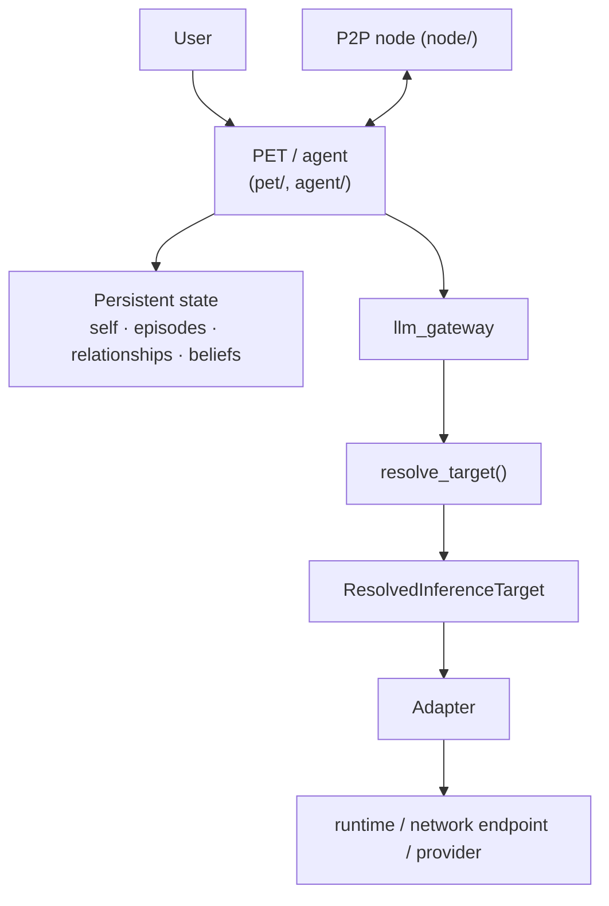

# YANDI — You AND I

YANDI is a local-first, persistent AI agent with its own memory, relationship state and epistemic
checks, built so that the language model behind it is replaceable. It ships together with a Rust P2P
node that lets independent YANDI instances discover each other and exchange verified knowledge.

> **Status: experimental, under active development.** Interfaces change, parts are shadow-mode or
> partially wired, and nothing here is production-stable. See [Project status](#project-status) and
> [docs/KNOWN_ISSUES.md](docs/KNOWN_ISSUES.md).

## What is YANDI?

Most "AI assistants" are a prompt around one model. YANDI takes the opposite view:

```text
LLM != YANDI
```

The model is a swappable cognitive mechanism. What makes an instance *that* instance is the state
around it: what it remembers, what it believes and why, how it relates to the person it talks to,
and what it has learned from its own mistakes. That state lives in a database owned by the agent,
not in a model's context window, so it survives restarts and model swaps.

YANDI makes no claim about consciousness. It aims at *functional continuity*: persistent agent
state that causally changes later behaviour, and that can be inspected and tested.

## Core ideas

| Principle | Meaning |
|---|---|
| `MODEL != LOCATION != RUNTIME != ADAPTER != PROVIDER` | A logical model name says nothing about where it runs, what runs it, or who provides it. Each is resolved separately. |
| `ONE GENERATION ATTEMPT = ONE RESOLVED TARGET = ONE ADAPTER` | Every attempt (including fallbacks) resolves its own target and its own output contract. |
| `TRUST != TRUTH` | A source, a model, or an earlier conclusion is never true just because it is trusted. Claims need evidence. |
| `UNKNOWN != EMPTY`, `UNKNOWN != SUPPORTED` | "Memory unreachable" is not "nothing remembered"; "no evidence found" is not "supported". |
| `VISIBLE REPLY != INTERNAL STATE` | What the agent says to the user is separate from the state it records. State never leaks into replies. |
| `MEMORY MAY AFFECT THE REPLY` / `MEMORY MUST NOT BECOME A NEW USER EVENT` | Remembered events may colour a reply, but only the current user message can create a new event. |

## Architecture



Details: [docs/ARCHITECTURE.md](docs/ARCHITECTURE.md).

### Inference layer

A caller asks for a *logical model*. `llm_gateway` resolves it to one concrete target and one adapter:

```text
logical model → resolve_target() → ResolvedInferenceTarget → Adapter → runtime / endpoint / provider
```

Adapters in the code today:

| Adapter | Talks to |
|---|---|
| `llama_cpp` | In-process llama.cpp (GGUF weights) |
| `ollama_compatible` | An Ollama-compatible HTTP server |
| `openai_compatible` | OpenAI-compatible HTTP endpoints |
| `anthropic` | Anthropic Messages API |

Ollama is one compatibility adapter and an automatic fallback for the built-in local engine; it is
not the foundation of the system. A model explicitly configured by the node owner never silently
falls back to another source. See [docs/INFERENCE_GATEWAY.md](docs/INFERENCE_GATEWAY.md).

### Persistent agent

Implemented layers, stored in a dedicated SQL instance:

- **Self model** — durable facts about who the agent is.
- **Episodic memory** — write-back of answered questions and outcomes.
- **Relationship memory** — grievances and forgiveness as an explicit lifecycle
  (registered → acknowledged → understood → healing → forgiven/unforgiven), with a current-event
  provenance guard and deterministic apology-to-grievance matching.
- **Beliefs** — confidence with evidence for and against, history and decay.
- **Reflection** — policies learned from the agent's own mistakes.

See [docs/MEMORY_AND_IDENTITY.md](docs/MEMORY_AND_IDENTITY.md).

### Epistemic core

Answers from the orchestrator are built from claims, each checked against retrieved evidence, and
receive a trust label (`UNVERIFIED`, `WEAKLY_SUPPORTED`, `PARTIALLY_SUPPORTED`, `STRONGLY_SUPPORTED`,
…). Trust is computed from evidence coverage and source independence, not from who said it. See
[docs/EPISTEMIC_CORE.md](docs/EPISTEMIC_CORE.md).

### P2P node

`node/` is a Rust node: encrypted peer transport, DHT-based discovery, SOCKS5/HTTP proxy layers, a
local web UI, and an AI-RPC layer through which peers can request inference or share knowledge.
Inbound peer requests are served through a loopback-only bridge into `llm_gateway`; a remote peer
cannot choose the backend model. The node is experimental; its own state notes are in
[node/CURRENT_STATE.md](node/CURRENT_STATE.md).

## Project status

| Area | State |
|---|---|
| `llm_gateway` adapters, target resolution, semantic (reply + state) output | Implemented, covered by regression tests |
| PET personal chat with persistent relationship state | Implemented; event recall is still being improved |
| Orchestrator with claim/evidence verification | Implemented; canonical trust computed in shadow mode alongside the live value |
| Beliefs, reflection, episodic memory | Implemented; only partly wired into the live chat path |
| P2P node (Rust) | Experimental |
| Embeddings through the adapter layer | Partial |
| Additional adapters, multi-user identity, cross-node trust graph | Planned |

## Repository structure

```text
agent/        Orchestrator, claim/evidence pipeline, memory, beliefs, reflection, SQL layer (agent/db/sql)
llm_gateway/  Model resolution, adapters, output contracts, secure config store, loopback intelligence bridge
pet/          FastAPI server: personal chat (chat_local), council chat, browser extension
node/         Rust P2P node (transport, DHT, proxy layers, AI-RPC, web UI, mobile client sources)
deploy/       Reference systemd units and installer for one specific host (adapt before use)
scripts/      Helper scripts (test runner)
docs/         Architecture and design documentation
```

The repository root also contains dated audit and report files (`YANDI_*_AUDIT.md`, `*_REPORT.md`,
`ROADMAP_v7.md`). They are development history; [docs/README.md](docs/README.md) indexes them.

## Quick start

Requirements: Python 3.10+, Redis, and a MySQL-compatible database for the persistent state layer
(see `agent/db/sql/`). A local model is optional at first; without SQL the chat still answers but
runs with degraded memory.

```bash
git clone https://github.com/ispolkom/yandi.git
cd yandi
python3 -m venv .venv && . .venv/bin/activate
pip install -r requirements.txt

redis-server &            # or: sudo systemctl start redis
./start.sh                # PET server on http://127.0.0.1:9010
./start.sh 8080           # custom port
```

`start.sh` picks its interpreter from `YANDI_PYTHON`, then `./.venv`, then `~/venv`, then `python3`.
`start_headless.sh` runs the storage + orchestrator server without the browser UI. The PET server binds
to loopback by default (`--host`, or `YANDI_PET_HOST` for `start_headless.sh`, changes that); do not
expose it to an untrusted network.

### Local inference

```bash
pip install llama-cpp-python       # optional; not in requirements.txt
python -m llm_gateway.setup        # choose a local .gguf file or a remote endpoint for this node
```

`llm_gateway.setup` stores the choice in the node's own config store. The built-in default model
registry inside `llm_gateway/llamacpp_backend.py` points at a path on the reference machine; on any
other machine, configure a model explicitly.

### External / network inference

`llm_gateway.setup` can also register an OpenAI-compatible or Anthropic endpoint. API keys are read
from an environment variable whose *name* is stored in the config, never from the config itself.

### Node

```bash
cd node
cargo build --release
./target/release/yandi
```

## Tests

```bash
scripts/test-core.sh                       # core deterministic suites
YANDI_PYTHON=/path/to/python scripts/test-core.sh
```

The core suites use a mocked model and in-memory fakes. See [docs/TESTING.md](docs/TESTING.md).

## Documentation

Start at [docs/README.md](docs/README.md):
[Architecture](docs/ARCHITECTURE.md) ·
[Inference gateway](docs/INFERENCE_GATEWAY.md) ·
[Memory and identity](docs/MEMORY_AND_IDENTITY.md) ·
[Epistemic core](docs/EPISTEMIC_CORE.md) ·
[Testing](docs/TESTING.md) ·
[Known issues](docs/KNOWN_ISSUES.md)

## Security and privacy

YANDI is designed local-first: the agent's state and memory stay in a database on your machine, and
the local chat server binds to loopback. That is a design intent, not a guarantee; the project is
experimental and has not been independently audited. Never commit runtime data, conversation
history, model weights or credentials. See [SECURITY.md](SECURITY.md).

## Roadmap

Direction, not a promise: wire the existing cognitive subsystems into one causally connected agent
(canonical ownership of identity/beliefs/relationships, defined update rules, counterfactual tests),
route embeddings through the adapter layer, add more adapter types, and mature the P2P layer. The
long-form self-learning plan is in [ROADMAP_v7.md](ROADMAP_v7.md).

## License

Licensing terms have not yet been finalized. The Rust crate manifest (`node/Cargo.toml`) declares
`MIT` for the node crate; the repository as a whole has no license file yet.
